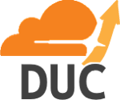

# CloudflareDUC
### A DNS update client for Cloudflare enabled domains  

 

  

  

## Table of Contents:

- **[Installation](#installation)**
    - [Generating an API Token](#generating-an-api-token)
- **[Troubleshooting](#troubleshooting)**
- **[Legal Information](#legal-information)**
    - [License](#license)
    - [Disclaimer](#disclaimer)
    - [Data Collection](#data-collection)
    - [Inquiries / Contact](#inquiries)

---

   

## Installation:

1. [Download the latest version here.](/releases#TODO:) Alternatively, clone or download the source code and run it with the command `node .`
2. Start the executable in a terminal that has a stdin and stdout.
3. Enter your API token. Important: Please read the ["Generating an API Token"](#generating-an-api-token) section on how to do this.
4. Choose which domains and DNS records you want to be updated in the main menu.

If you want the process to run in a stdin-less terminal or want it to run in the background using a third-party process manager, you can start it with the argument `--nogui` or `-n`

   

### Generating an API Token:
1. Go to your account settings and click on the tab "API Tokens" (alternatively, [click here](https://dash.cloudflare.com/profile/api-tokens))
2. Under the section **API Tokens**, click the button that says `Create Token`
3. Scroll all the way down and click the button titled `Get Started` next to the option **Create Custom Token**
4. Set all options like shown in this picture:  
  
  
  
5. Continue to the summary, create the token and copy it. This token can now be given to CF-DUC so it has access to the Cloudflare API.  
Note that you cannot view the token again, unless you "Roll" (re-generate) it, in which case you need CF-DUC to re-authenticate.  
Also please protect this token like a password (it kinda is one). If you give it to someone, they can access parts of your Cloudflare account.

   

## Troubleshooting:

- **Domain(s) or Record(s) are not showing up in CF-DUC**  
      
    This is probably because you have entered wrong login information or your API token doesn't have the right permissions.  
    In this case, use the option <!-- TODO: -->"Reconfigure" in the main menu of CF-DUC.  
    Then make sure you enter the E-Mail address of an account that has read and write access to the domain(s) and/or record(s) you want to be supervised.  
    Make sure the API token is generated just as the ["Generating an API Token"](#generating-an-api-token) section states and try again.
  
- **Validation Error on first startup sequence**  
      
    In this case either your API token doesn't exist, you have copied/pasted it wrong or it doesn't have the necessary permissions.  
    Make sure the API token is generated just as the ["Generating an API Token"](#generating-an-api-token) section states and try again.

   

## Legal Information:

 

### License:
CloudflareDUC is licensed under the [MIT license](https://sv443.net/LICENSE)  

 

### Disclaimer:

CloudflareDUC will store an API token in the same directory the executable is located in.  
Please protect this token like a password and do not share it as that might give unwanted people access to your Cloudlfare account!  
The token will be lightly encrypted so general-purpose scraper malware can't easily grab it but note that skilled people can easily decrypt it if they get a hold of it.  
To limit the possible amount of damage that could be done, please strictly follow the installation guide as that will ensure the API token only has access to the bare minimum.

 

### Data Collection:
CloudflareDUC does not collect any data about you, except for the data you provide in the initial configuration prompts. All of this data is stored on your own machine and is never transferred to any service but the official Cloudflare API.  

 

### Inquiries:
If you need to contact me, please either [join my Discord server](https://sv443.net/discord) or contact me via E-Mail: [`contact@sv443.net`](mailto:contact@sv443.net)

 

### Dependencies:
CloudflareDUC needs the following dependencies (and their sub-dependencies) to ensure stability, security and maintainability:  

- [dotenv](https://npmjs.com/package/dotenv)
- [fs-extra](https://npmjs.com/package/fs-extra)
- [is-ip](https://npmjs.com/package/is-ip)
- [prompts](https://npmjs.com/package/prompts)
- [svcorelib](https://npmjs.com/package/svcorelib)
- [xmlhttprequest](https://npmjs.com/package/xmlhttprequest)
